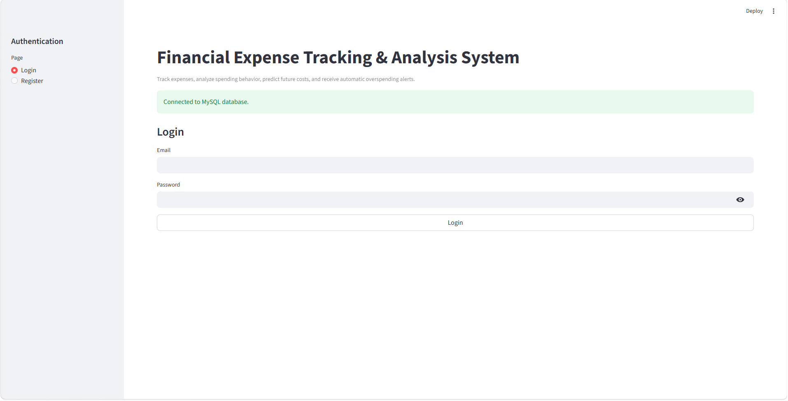
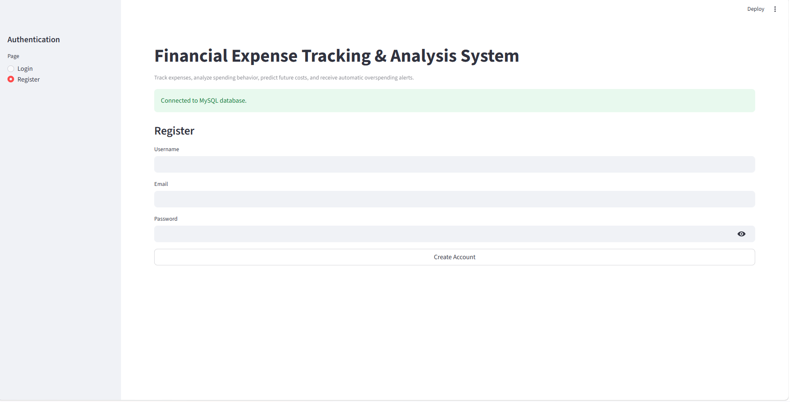
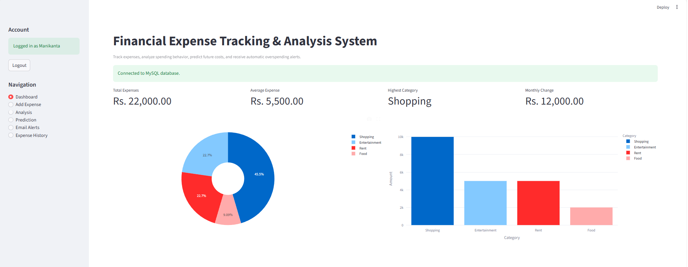
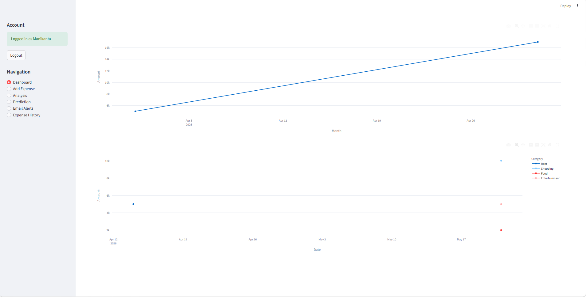
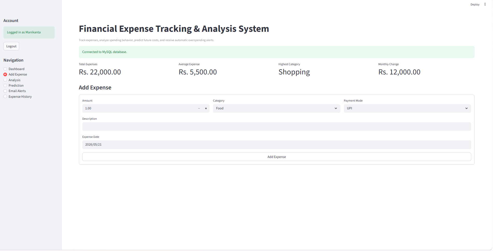
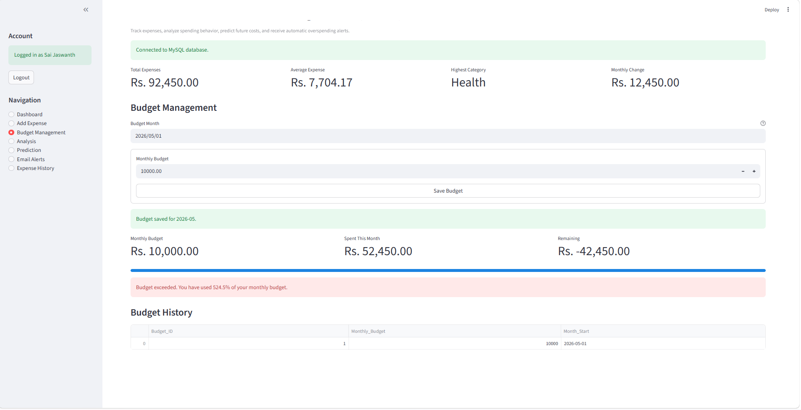
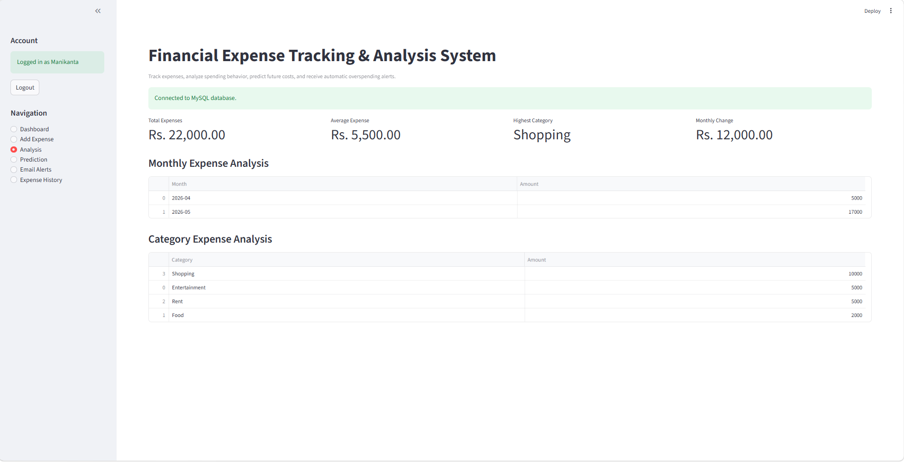
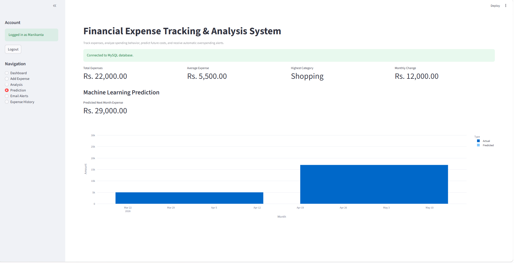
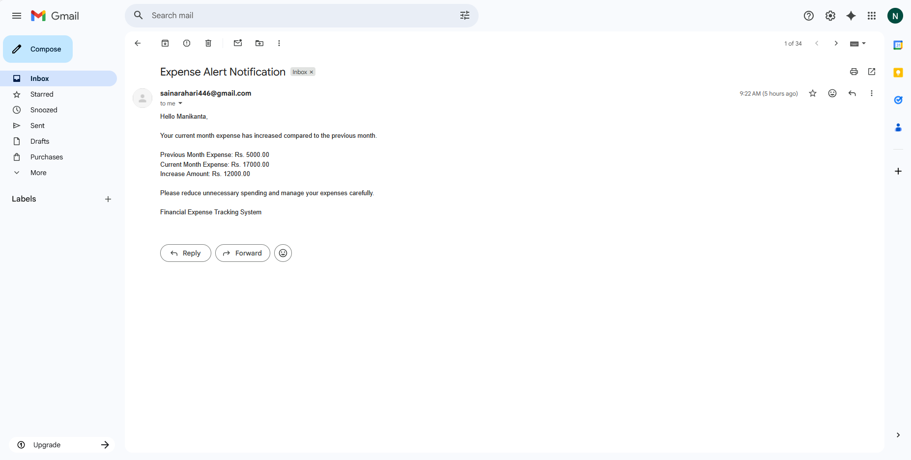
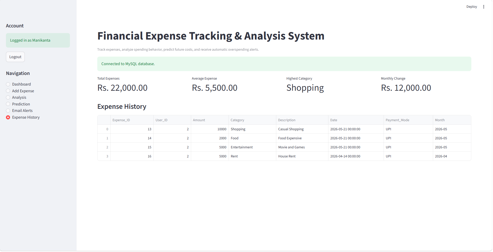

# Financial Expense Tracking & Analysis System

A smart web-based financial management application built with **Streamlit**, **Python**, **MySQL**, **Plotly**, **Scikit-learn**, **JWT authentication**, **Google OAuth**, and **SMTP email automation**. The system helps users record daily expenses, set monthly budgets, analyze spending patterns, visualize financial data, predict future expenses, and automatically receive email alerts when their current month spending increases compared to the previous month.

---

## Table of Contents

- [How It Works](#how-it-works)
- [Tech Stack](#tech-stack)
- [Project Structure](#project-structure)
- [Setup & Installation](#setup--installation)
- [Environment Variables](#environment-variables)
- [Running the App](#running-the-app)
- [Screenshots](#screenshots)
- [Dataset Usage](#dataset-usage)
- [Pages & Features](#pages--features)
- [Budget Management](#budget-management)
- [Authentication Flow](#authentication-flow)
- [Automatic Email Alert System](#automatic-email-alert-system)
- [Machine Learning Prediction](#machine-learning-prediction)
- [Database Tables](#database-tables)
- [Verification Checklist](#verification-checklist)

---

## How It Works

The application follows a simple expense management workflow:

```text
User Registration
       |
User Login
       |
JWT Authenticated Session
       |
Add Daily Expenses
       |
Set Monthly Budget
       |
Store Data in MySQL
       |
Analyze Monthly Spending
       |
Generate Charts and Graphs
       |
Predict Future Expenses
       |
Compare Current Month vs Previous Month
       |
Send Automatic Email Alert if Spending Increased
```

1. **Register** with username, email, and password.
2. **Login** securely using email and password.
3. **Add expenses** with amount, category, description, payment mode, and date.
4. **Set monthly budgets** and compare actual spending against the selected month's budget.
5. **Analyze spending** using monthly and category-wise summaries.
6. **Visualize expenses** using pie charts, bar charts, and line charts.
7. **Predict future expenses** using Linear Regression.
8. **Receive automatic alerts** when current month expenses are higher than previous month expenses.

Each user only sees their own expense records after login.

---

## Tech Stack

| Category | Technology / Library | Purpose in This Project |
| --- | --- | --- |
| Frontend Web App | Streamlit | Builds the web interface, pages, sidebar navigation, forms, metrics, and tables |
| Backend Language | Python | Handles authentication, database logic, analysis, prediction, and email automation |
| Database | MySQL | Stores users, expenses, budgets, and email alert history |
| Database Driver | mysql-connector-python | Connects Python code to the MySQL database |
| Data Handling | Pandas | Loads CSV data, prepares expense records, groups monthly/category totals, and supports analysis |
| Numerical Computing | NumPy | Supports numerical indexing and model input preparation for prediction |
| Data Visualization | Plotly Express | Creates interactive pie charts, bar charts, and line charts |
| Extra Charting Support | Matplotlib | Included for plotting support and future chart extensions |
| Machine Learning | Scikit-learn | Uses Linear Regression to predict next month expenses |
| Password Security | bcrypt | Hashes user passwords before storing them in MySQL |
| Token Authentication | PyJWT | Generates JWT tokens after successful login |
| Google Login | Google OAuth 2.0 with requests | Allows users to sign in with Google and links/creates accounts in MySQL |
| Email Automation | SMTP / smtplib | Sends automatic overspending alerts to registered users |
| Configuration | `.env` and Streamlit secrets | Stores SMTP, Google OAuth, JWT, and optional MySQL settings |
| Dataset | `expenses_dataset.csv` | Provides fallback/demo data for analysis, visualization, and prediction |

### Main Python Packages Used

| Package | Used For |
| --- | --- |
| `streamlit` | Web application UI |
| `pandas` | Dataset loading and expense analysis |
| `plotly` | Interactive charts |
| `scikit-learn` | Linear Regression prediction |
| `mysql-connector-python` | MySQL database connection |
| `bcrypt` | Password hashing |
| `PyJWT` | JWT token generation |
| `requests` | Google OAuth token and user profile requests |
| `secure-smtplib` / `smtplib` | SMTP email alert sending |

---

## Project Structure

```text
Financial_Expense_Tracker/
|-- .env                         # Local SMTP/MySQL environment variables
|-- .gitignore                   # Ignored local files and secrets
|-- app.py                       # Main Streamlit application and routing
|-- docs/
|   `-- screenshots/             # README application screenshots
|-- expenses_dataset.csv         # Sample dataset for analysis/demo mode
|-- requirements.txt             # Python dependencies
|-- README.md                    # Project documentation
|
|-- auth/
|   |-- __init__.py
|   |-- google_oauth.py          # Google OAuth URL, callback, and account creation helpers
|   |-- login.py                 # User login and JWT token creation
|   `-- register.py              # User registration and password hashing
|
|-- database/
|   |-- __init__.py
|   `-- db.py                    # MySQL connection, table creation, CRUD, budget helpers
|
`-- modules/
    |-- __init__.py
    |-- add_expense.py           # Expense categories, payment modes, save helper
    |-- analysis.py              # Monthly/category analysis and summary metrics
    |-- email_alert.py           # SMTP email message and sending logic
    |-- prediction.py            # Linear Regression expense prediction
    `-- visualization.py         # Plotly chart generation
```

---

## Setup & Installation

### Prerequisites

- Python 3.10 or above
- MySQL Server
- Gmail account with App Password enabled
- pip package manager

### Step 1: Open Project Folder

```cmd
cd "C:\Users\sai jaswanth\Desktop\Financial_Expense_Tracker"
```

### Step 2: Create Virtual Environment

```cmd
python -m venv venv
```

### Step 3: Activate Virtual Environment

```cmd
venv\Scripts\activate
```

### Step 4: Install Dependencies

```cmd
pip install -r requirements.txt
```

### Step 5: Create MySQL Database

Open MySQL and run:

```sql
CREATE DATABASE expense_tracker;
```

The required tables are created automatically when the app starts.

---

## Environment Variables

Create a `.env` file in the project root:

```text
SMTP_EMAIL=your_sender_gmail@gmail.com
SMTP_APP_PASSWORD=your_gmail_app_password
GOOGLE_CLIENT_ID=your_google_client_id
GOOGLE_CLIENT_SECRET=your_google_client_secret
GOOGLE_REDIRECT_URI=http://localhost:8501
```

Optional MySQL values can also be added:

```text
MYSQL_HOST=localhost
MYSQL_USER=root
MYSQL_PASSWORD=your_mysql_password
MYSQL_DATABASE=expense_tracker
```

The app currently uses these MySQL defaults if values are not provided:

```text
MYSQL_HOST=localhost
MYSQL_USER=root
MYSQL_PASSWORD=Jaswanth@939
MYSQL_DATABASE=expense_tracker
```

Important:

- Use a Gmail App Password, not your normal Gmail password.
- For Google OAuth, create OAuth credentials in Google Cloud Console.
- Add `http://localhost:8501` as an authorized redirect URI for local development.
- Do not upload `.env` to GitHub.
- `.env` is already added to `.gitignore`.

---

## Running the App

Activate the virtual environment:

```cmd
venv\Scripts\activate
```

Start Streamlit:

```cmd
streamlit run app.py
```

Open the app in your browser:

```text
http://localhost:8501
```

---

## Screenshots

### Login Page

The login page is shown first. Users must authenticate before accessing dashboard navigation.



### Register Page

The register page allows a new user to create an account using username, email, and password.



### Dashboard

The dashboard gives the user a quick overview of total expenses, average expense, highest spending category, monthly change, and category-wise visual charts.




### Add Expense Page

The Add Expense page allows users to enter amount, category, payment mode, description, and expense date. After saving, the expense is stored in MySQL and the automatic alert check runs in the backend.



### Budget Management Page

The Budget Management page lets users save a monthly budget, compare it with actual spending, view remaining balance, and see whether the budget is safe, near limit, or exceeded.



### Analysis Page

The Analysis page shows monthly expense totals and category-wise expense totals in table format.



### Prediction Page

The Prediction page uses Linear Regression to forecast the next month expense from previous monthly spending trends.



### Email Alerts Page

The Email Alerts page displays previous month expense, current month expense, alert status, and SMTP configuration status. Alerts are sent automatically in the backend when spending increases.



### Expense History Page

The Expense History page displays saved expenses for the logged-in user.



After login, the sidebar navigation shows the main project modules: Dashboard, Add Expense, Budget Management, Analysis, Prediction, Email Alerts, and Expense History.

---

## Dataset Usage

Yes, this project includes and uses a dataset.

Dataset file:

```text
expenses_dataset.csv
```

The dataset is a custom expense dataset used for sample/demo analysis, visualization, and prediction when live MySQL expense data is unavailable.

### Dataset Columns

| Column | Description |
| --- | --- |
| Expense_ID | Unique expense record ID |
| Date | Expense date |
| Category | Expense category such as Food, Travel, Bills, Health, etc. |
| Amount | Expense amount |
| Payment_Mode | Payment method such as UPI, Cash, Card, or Net Banking |
| Description | Short expense note |
| Monthly_Budget | Monthly budget value |
| Savings | Remaining savings after expenses |
| Expense_Status | Whether the expense is within budget or overspending |

### How the Dataset Is Used

The app loads the dataset in `app.py`:

```python
DATASET_PATH = BASE_DIR / "expenses_dataset.csv"

def load_sample_data():
    df = pd.read_csv(DATASET_PATH)
```

The data source depends on database availability:

| Condition | Data Source |
| --- | --- |
| MySQL connected and user logged in | User expense records from MySQL |
| MySQL not connected | Sample data from `expenses_dataset.csv` |

So, in normal usage, the system stores and reads user expenses from MySQL. The CSV dataset works as a fallback/demo dataset for charts, analysis, and ML prediction.

---

## Pages & Features

After login, the sidebar navigation displays the main application pages.

### 1. Login Page

The first page shown before entering the system.

| Field | Description |
| --- | --- |
| Continue with Google | Login or create account using Google OAuth |
| Email | Registered user email |
| Password | Secure password input |

On successful login:

- Password is verified using bcrypt.
- JWT token is generated.
- User session is stored in Streamlit session state.
- Automatic expense alert check runs in the backend.

If Google login is used, the app receives the Google user profile, creates or links the user in MySQL, generates a JWT token, and opens the dashboard.

### 2. Register Page

Allows a new user to create an account.

| Field | Description |
| --- | --- |
| Username | Name of the user |
| Email | Unique email address |
| Password | Password that is hashed before database storage |

### 3. Dashboard

Shows a quick summary of the user's financial activity.

| Metric | Description |
| --- | --- |
| Total Expenses | Total amount spent |
| Average Expense | Average transaction amount |
| Highest Category | Category with the highest spending |
| Monthly Change | Difference between current and previous month spending |

Charts shown:

- Category-wise pie chart
- Category-wise bar chart
- Monthly expense line chart
- Daily expense trend chart

### 4. Add Expense

Allows the user to add a new expense.

| Field | Description |
| --- | --- |
| Amount | Expense amount |
| Category | Food, Travel, Shopping, Bills, Health, Education, etc. |
| Payment Mode | UPI, Cash, Card, Net Banking, Wallet |
| Description | Short note about the expense |
| Expense Date | Date of expense |

After saving an expense:

- Data is inserted into MySQL.
- Dashboard and analysis values update.
- Backend automatically checks whether email alert is required.

### 5. Budget Management

Allows the user to set or update a monthly budget and compare it with actual expenses for the selected month.

| Section | What It Shows |
| --- | --- |
| Budget Month | Month selected for budget tracking |
| Monthly Budget | Saved budget amount for the selected month |
| Spent This Month | Total expenses recorded in that month |
| Remaining | Budget balance after spending |
| Progress Bar | Percentage of budget used |
| Budget History | Previously saved monthly budgets |

Budget status:

- Under 80% usage: budget is under control.
- 80% to 99% usage: warning that the budget is close to the limit.
- 100% or more: budget exceeded.

### 6. Analysis

Displays tabular analysis of spending.

| Section | What It Shows |
| --- | --- |
| Monthly Expense Analysis | Total spending per month |
| Category Expense Analysis | Total spending per category |

### 7. Prediction

Uses Machine Learning to predict the next month expense.

| Section | What It Shows |
| --- | --- |
| Predicted Next Month Expense | Forecasted expense amount |
| Prediction Chart | Actual monthly expenses and predicted value |

At least two months of expense data are required for prediction.

### 8. Email Alerts

Shows the current email alert status.

| Section | What It Shows |
| --- | --- |
| Previous Month | Previous month total expense |
| Current Month | Current month total expense |
| Alert Status | Whether spending increased or is under control |
| SMTP Status | Whether email configuration is available |

There is no manual send button. Alerts are checked and sent automatically in the backend.

### 9. Expense History

Displays all saved expenses of the logged-in user in table format.

---

## Budget Management

The budget management feature uses the `budgets` table to store one budget per user per month.

The app also includes automatic migration logic for older MySQL tables. If an older `budgets` table does not have `month_start` or `monthly_budget`, the missing columns are added automatically when the app starts.

Example:

```text
User: Manikanta
Budget Month: 2026-05
Monthly Budget: Rs. 20,000
Spent This Month: Rs. 17,000
Remaining: Rs. 3,000
```

The app calculates:

```text
usage = spent_this_month / monthly_budget
```

Then it displays:

| Usage | Status |
| --- | --- |
| Less than 80% | Budget under control |
| 80% to 99% | Budget warning |
| 100% or more | Budget exceeded |

This helps users control monthly spending before it becomes overspending.

---

## Authentication Flow

```text
Register
   |
Hash Password with bcrypt
   |
Store User in MySQL
   |
Login
   |
Verify Email and Password
   |
Generate JWT Token
   |
Create Streamlit Session
   |
Show Dashboard and Navigation
```

Authentication features:

- Passwords are not stored as plain text.
- bcrypt is used for password hashing.
- Google OAuth can be used instead of password login.
- Existing email accounts can be linked with Google login.
- JWT is generated after login.
- Session state controls access to app pages.
- Navigation appears only after login.

---

## Automatic Email Alert System

The system automatically compares the logged-in user's monthly expenses.

```text
Previous Month Expense = Rs. 40,000
Current Month Expense  = Rs. 52,000

Current Month > Previous Month
        |
Send Automatic Email Alert
```

Alert checks run automatically:

- after user login
- after adding a new expense

Email is sent only when:

```text
current month expense > previous month expense
```

The system stores sent alerts in the `email_alerts` table to avoid sending the same monthly alert repeatedly.

Example email:

```text
Hello User,

Your current month expense has increased compared to the previous month.

Previous Month Expense: Rs. 40000.00
Current Month Expense: Rs. 52000.00
Increase Amount: Rs. 12000.00

Please reduce unnecessary spending and manage your expenses carefully.

Financial Expense Tracking System
```

---

## Machine Learning Prediction

The project uses the **Linear Regression** algorithm.

### Input Data

Monthly expense totals are generated from historical expense records.

```text
Month 1 -> Rs. 10000
Month 2 -> Rs. 12000
Month 3 -> Rs. 15000
```

### Output

The model predicts the next month expense.

```text
Next Month Expense -> Rs. 18000
```

### Why ML Is Used

- To identify future spending trends
- To support financial planning
- To help users control overspending before it happens

---

## Database Tables

The app automatically creates these MySQL tables.

### users

Stores registered user accounts.

| Column | Purpose |
| --- | --- |
| id | User ID |
| username | User name |
| email | Unique login email |
| password | Hashed password for local login, nullable for Google users |
| auth_provider | Login provider such as `local` or `google` |
| google_sub | Unique Google account subject ID for OAuth users |
| created_at | Account creation timestamp |

### expenses

Stores user expense records.

| Column | Purpose |
| --- | --- |
| id | Expense ID |
| user_id | Owner user ID |
| amount | Expense amount |
| category | Expense category |
| description | Expense note |
| expense_date | Expense date |
| payment_mode | UPI, Cash, Card, Net Banking, Wallet |
| created_at | Record creation timestamp |

### budgets

Stores monthly budget values.

| Column | Purpose |
| --- | --- |
| id | Budget ID |
| user_id | Owner user ID |
| monthly_budget | Budget amount |
| month_start | First date of the budget month |

### email_alerts

Stores sent alert history to prevent duplicate emails.

| Column | Purpose |
| --- | --- |
| id | Alert ID |
| user_id | User who received alert |
| alert_month | Month for which alert was sent |
| previous_amount | Previous month expense |
| current_amount | Current month expense |
| sent_at | Email sent timestamp |

---

## Verification Checklist

Use this checklist to verify the project.

### Basic App Check

```cmd
streamlit run app.py
```

Open:

```text
http://localhost:8501
```

### Syntax Check

```cmd
py -m compileall app.py auth database modules
```

### Functional Check

1. Register a new user.
2. Login with the registered email and password.
3. Add expenses for the previous month.
4. Add expenses for the current month.
5. Make current month spending higher than previous month spending.
6. Open Budget Management and set a monthly budget.
7. Confirm the app shows remaining budget and budget status.
8. Confirm that the automatic email alert is sent when current month spending increases.
9. Open Dashboard and verify charts.
10. Open Analysis and verify monthly/category tables.
11. Open Prediction and verify next month expense prediction.
12. Open Expense History and verify saved records.

---

## Notes

- MySQL must be running for login, registration, real expense storage, and automatic alerts.
- If MySQL is not connected, the app can still show dashboard visuals using the sample CSV dataset.
- SMTP credentials are loaded from `.env` or Streamlit secrets.
- The `.env` file is ignored by Git because it contains private credentials.
- Do not share Gmail App Passwords publicly.
